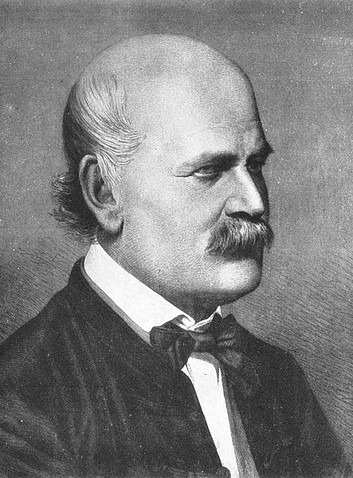

## Meet Dr. Ignaz Semmelweis

Photo by [Wikimedia](https://commons.wikimedia.org/wiki/File:Ignaz_Semmelweis_1860.jpg)
<!--

-->

This is Dr. Ignaz Semmelweis, a Hungarian physician born in 1818 and active at the Vienna General Hospital. 

In an article by Dr. Howard Markel in 2015 on [PBS News Hour](https://www.pbs.org/newshour/health/ignaz-semmelweis-doctor-prescribed-hand-washing), it was outlined that in 1850, Dr. Semmelweis saved lives with three words: ***Wash Your Hands***.

In this notebook, we're going to reanalyze the data that made Semmelweis discover the importance of <em>handwashing</em>. 

[Let's start](https://github.com/anunda-nyagami/hand-washing/blob/main/notebook.ipynb) by looking at the data that made Semmelweis realize that something was wrong with the procedures at Vienna General Hospital.

